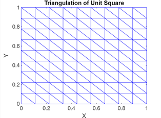
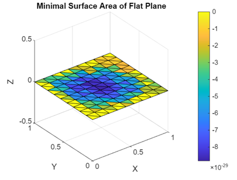
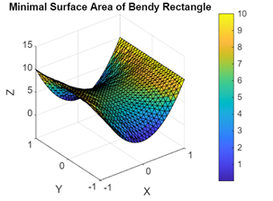
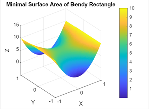
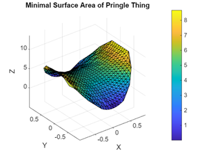
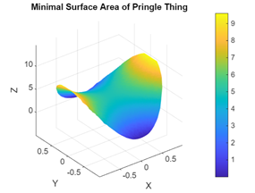

# minimal-surface-area
A course project to write a program to minimize surface area using CVX in Matlab

Visualizations:

  
  
 

By creating a 2D triangulation and fixing the boundary points of the shape, one can minimize the sum of the area of each of the triangulations to approximate a minimal surface area for a given set of boundary points. While this isn't necessarily the most efficient way to complete this task, it was good practice working with CVX in MatLab and turning theoretical math into a cool, working algorithm with visualizations.
